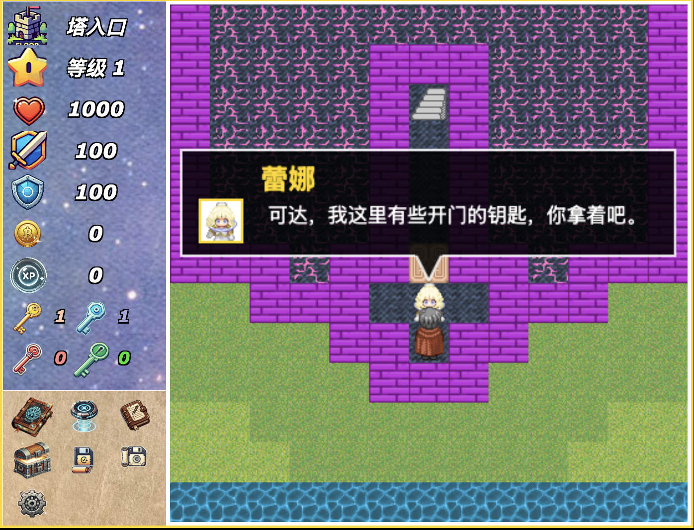

# End Tower

End Tower is a 2D game, whose prototype is `magic tower 23 floors`(“魔塔23层”，a very nice game in China, h5 version of game is [here](https://h5mota.com/landing.php/)), most enemies and terrain image resource are come from that game.

This project is written in Typescript.

> Note: The game has a high difficulty level.

## How to play

```shell
npm install
npm run start
```

Then open your browser and visit `http://localhost:8133`.


It can be played on both PC and mobile devices(lock portrait orientation is best).

## Game screenshot


